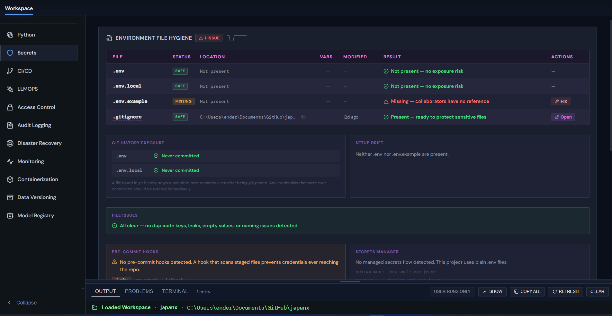

# Launchline





Launchline is a standalone Electron desktop app for two practical workflows:

- Python environment tooling for local developer setup
- Production-readiness audits for application repos

It is designed as a local desktop workspace for checking Python runtime health, managing project venv workflows, and scanning a codebase for production concerns such as secrets hygiene, CI/CD coverage, observability, access control, recovery posture, and related operational signals.

## Current Product Status

Launchline is usable. Maturity varies across pages.

- `Python` is one of the strongest parts of the app and has the most complete edit surface.
- `Secrets` is the most polished production audit page.
- `LLMOPS` is the most recently refreshed audit page and covers provider configuration, prompt testing, evals, and model operations posture.
- The remaining production audit pages run real repo scans but are still earlier-stage surfaces.

## Working Features

### Python

The Python page is the primary operational workspace for local Python setup. It has three tabs: Main, Installs, and Package Catalog.

Current capabilities include:

- Detecting local `uv`, Python, and virtual environment status with live health scoring
- Viewing actionable health checks that scroll directly to the relevant control when clicked
- Detecting the default launcher runtime and available Python installations with download CTAs when runtimes are missing
- Viewing `uv` install status with a one-step install prompt when not found
- Managing `pyproject.toml` from inside the app: reading project metadata (name, version, status), editing `requires-python`, adding and removing base dependencies, creating and deleting dependency groups, all writing directly to the file
- A browsable package catalog with PyPI import and a bridge for adding catalog packages directly to `pyproject.toml`
- Creating, rebuilding, syncing, and deleting the project virtual environment
- Inspecting installed venv packages and reading dependency summaries across sources
- Tracking command output, run history, and terminal access from an embedded log panel
- Opening relevant paths and folders directly from the UI

The Python page is connected to real Electron main-process IPC and local filesystem operations throughout.

### Secrets

The Secrets page is the most mature production audit in Launchline.

Current capabilities include:

- Scanning `.env`, `.env.local`, `.env.example`, and related environment files
- Checking gitignore coverage for local secret-bearing files
- Comparing expected provider variables against current env-file contents
- Showing hygiene trends and surfacing follow-up actions
- Tracking rotation reminders in app settings
- Detecting history exposure and setup drift between env files

If you are evaluating Launchline as a portfolio project, Secrets is currently the strongest example of the production-audit workflow.

### LLMOPS


The LLMOPS page covers the LLM-facing operational surface for an application.

Current capabilities include:

- Provider configuration and selection across major hosted model providers
- Prompt testing and saved prompt management
- Eval run history and structured evaluation workflows
- Feature-to-model binding configuration
- Runtime posture review for LLM-dependent workloads

### Production: Other Audit Pages

The remaining production pages each have a real UI and call real workspace scans in the Electron backend.

Current pages:

- `Containerization` — Docker, Compose, and Kubernetes posture
- `CI/CD` — Pipeline coverage, workflow files, and delivery posture
- `Monitoring` — Logging, metrics, tracing, and alerting signals
- `Data Versioning` — DVC, data assets, schemas, and reproducibility posture
- `Model Registry` — Experiment tracking, model artifacts, and registry posture
- `Disaster Recovery` — Backups, runbooks, failover, and recovery posture
- `Audit Logging` — Traceability, audit trails, and retention posture
- `Access Control` — Authentication, authorization, and RBAC review

Each page provides workspace scanning against repo files and configuration, readiness scores, checklist-style summaries, and heuristic detection of technologies and operational signals for that domain.

These pages are working and real but are best described as early-stage and more heuristic than deeply validated. They are solid portfolio evidence of the product direction and engineering approach.

## Planned / Still Developing

- Deeper remediation guidance inside the non-Secrets production pages
- Stronger verification and calibration of production audit heuristics
- Packaging and release polish for end-user distribution
- Additional screenshots and demo material
- Continued modularization of the larger source files

## Storage

Launchline stores mutable app data under the OS app-data area instead of using the repo tree as the primary store.

Current storage model:

- Global app settings are stored separately from workspace-specific state
- Workspace history and UI state are scoped to the current repo
- Settings use a schema version plus migration logic
- Settings can be imported, exported, and reset from the app shell
- Secrets should stay in environment files or an external secret manager, not in settings JSON

## Run Locally

From the repo root:

```powershell
.\scripts\bootstrap.ps1
.\scripts\dev.ps1
```

If you need the manual fallback:

```powershell
C:\Users\ender\AppData\Local\nvm\nvm.exe use 24.14.1
$env:Path = 'C:\nvm4w\nodejs;' + $env:Path
C:\nvm4w\nodejs\npm.cmd start
```

## Runtime Notes

- Node `24.14.1` is the intended version for local development.
- Python `3.13` has been the safer choice on this machine.
- Python `3.14` previously hit an `onnxruntime` wheel incompatibility.
- The app can boot without automatically creating the venv if the setup script is missing.

## Positioning

Launchline is meant to showcase practical product and engineering judgment around:

- desktop app architecture with Electron + React
- Python environment tooling and reproducibility
- local-first operational review workflows
- production-readiness scanning across multiple reliability and security domains
- incremental cleanup of inherited architecture into a focused standalone product
